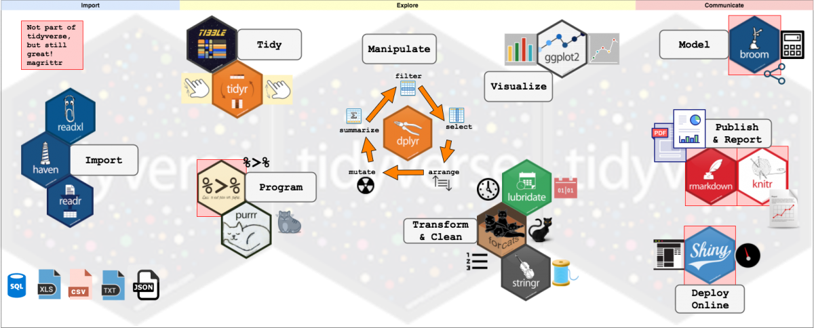

layout: true

```{r setup, include = F}
if (!require(easypackages)) install.packages("easypackages")
library(easypackages)

packages("knitr",
         "rmarkdown",
         "gadenbuie/xaringanExtra",
         "gadenbuie/tweetrmd",
         "hadley/emo",
         "sctyner/memer",
         prompt = F)

options(htmltools.dir.version = FALSE,
        htmltools.preserve.raw = FALSE)

opts_chunk$set(echo = TRUE,
               fig.align = "center")

xaringanExtra::use_xaringan_extra(c("tile_view", "clipboard"))
xaringanExtra::use_extra_styles(hover_code_line = TRUE,
                                mute_unhighlighted_code = FALSE)
```

<div class="my-footer">
  <div style="float: left;"><span>`r gsub("<br />", ", ", gsub("<br /><br />|<a.+$", "", metadata$author))`</span></div>
  <div style="float: right;"><span>`r metadata$location`, `r metadata$date`</span></div>
  <div style="text-align: center;"><span>`r gsub(".+<br />", " ", metadata$subtitle)`</span></div>
</div>

---

## About us

### Johannes Breuer

.small[
- Senior researcher in the team Data Augmentation, Department Survey Data Curation, [*GESIS  - Leibniz Institute for the Social Sciences*](https://www.gesis.org/en/home), Cologne, Germany

- (Co-)Leader of the team Research Data & Methods at the [*Center for Advanced Internet Studies*](https://www.cais.nrw/en/center-for-advanced-internet-studies-cais-en/) (CAIS), Bochum, Germany

- Main areas:
    - digital trace data for social science research
    - data linking (surveys + digital trace data) 
    
- Ph.D. in Psychology, University of Cologne  

- Previously worked in several research projects investigating the use and effects of digital media (Cologne, Hohenheim, Münster, Tübingen)  

- Other research interests
    - Computational methods
    - Data management
    - Open science

[johannes.breuer@gesis.org](mailto:johannes.breuer@gesis.org), [@MattEagle09](https://twitter.com/MattEagle09), [personal website](https://www.johannesbreuer.com/)
]

---

## About us

### Stefan Jünger

- postdoctoal researcher in the team Data Linking & Data Security at the GESIS Data Archive
    - main area: geospatial data/georeferencing  
    
- Ph.D. in social sciences, University of Cologne

- previously worked in the area of data ingest and as a curator of the data repository datorium and two DFG research projects on geospatial data

- other research interests:
    - quantitative methods
    - social inequalities & attitudes towards minorities
    - data management & data privacy

[stefan.juenger@gesis.org](mailto:stefan.juenger@gesis.org), [@StefanJuenger](https://twitter.com/StefanJuenger), [personal website](https://stefanjuenger.github.io/)

---

## About you

Please use the text chat to introduce yourself:

- What's your name?  

- Where do you work?  

- What do you work on?  

- What are your experiences with `R` and the `tidyverse`?  

- What are your motivations for joining this course? What are your expectations for this course?


---

## Prerequisites for this course

.large[
- Working versions of `R` and *RStudio*  

- Some basic knowledge of `R`  

- The `tidyverse` packages
]  

---

## Workshop Structure & Materials

- The workshop consists of a combination of short lectures and hands-on exercises

- Slides and other materials are available at

.center[`https://github.com/jobreu/tidyverse-workshop-esra-2021`]

---

## Course schedule

```{r schedule, echo = F}
schedule <- data.frame(
  "When?" = c("13:00 - 13:20", "13:20 - 13:30", "13:30 - 13:45", "13:45 - 14:00", "14:00 - 14:15", "14:15 - 14:45", "14:45 - 15:00", "15:00 - 15:30", "15:30 - 15:45", "15:45 - 16:00")
  , "What?" = c("Introduction: Welcome to the tidyverse", "Exercise 1", "Data import", "Exercise 2", "<i>Coffee break</i>", "Data wrangling - Part 1", "Exercise 3", "Data wrangling - Part 2", "Exercise 4", "Wrap-Up")
  , check.names = FALSE
)
knitr::kable(
  schedule
  , format = "html"
  , align = "cc"
  , escape = FALSE
)
```

---

## Online format

- If possible, we invite you to turn on your camera

- If you have an immediate question during the lecture parts, please send it via text chat
  - Public or private (ideally to the person currently not presenting if you want an immediate response)

- If you have a question that is not urgent and might be interesting for everybody, you can also use audio (& video) to ask it during the exercise parts

- We would also kindly ask you to mute your microphones when you are not asking a question or engaging in discussions or group work

---

## What is the `tidyverse`?

> The `tidyverse` is an .highlight[opinionated collection of R packages designed for data science]. All packages share an .highlight[underlying design philosophy, grammar, and data structures] ([Tidyverse website](https://www.tidyverse.org/)).

> The `tidyverse` is a .highlight[coherent system of packages for data manipulation, exploration and visualization] that share a .highlight[common design philosophy] ([Rickert, 2017](https://rviews.rstudio.com/2017/06/08/what-is-the-tidyverse/)).

```{r, out.width = "25%"}
include_graphics("./pics/hex-tidyverse.png")
```

---

## Benefits of the `tidyverse`

.large[
Most of the things we are going to show you can also be achieved with base `R`. However, the syntax for this is typically (more) verbose and not intuitive and, hence, difficult to learn, remember, and read (plus many `tidyverse` operations are faster than their base R equivalents).
]

---

## Benefits of the `tidyverse`

.large[  
`Tidyverse` syntax is designed to increase **human-readability**. This makes it especially **attractive for `R` novices** as it can facilitate the experience of **self-efficacy** (see [Robinson, 2017](http://varianceexplained.org/r/teach-tidyverse/)). The `tidyverse` also aims for **consistency** (e.g., data frame as first argument and output) and uses **smarter defaults** (e.g., no partial matching of data frame and column names).
]

---

## `tidyverse` for `R` beginners

```{r tidy meme}
meme_get("DistractedBf") %>% 
  meme_text_distbf("tidyverse", "new R users", "base R")
```

---

## Workflow

.center[

]
<small><small>Source: http://r4ds.had.co.nz/</small></small>

.highlight[- **Import**: read in data in different formats (e.g., .csv, .xls, .sav, .dta)
- **Tidy**: clean data (1 row = 1 case, 1 column = 1 variable), rename & recode variables, etc.
- **Transform**: prepare data for analysis (e.g., by aggregating and/or filtering)]
- **Visualize**: explore/analyze data through informative plots
- **Model**: analyze the data by creating models (e.g, linear regression model) 
- **Communicate**: present the results (to others)

---

## `Tidyverse` workflow

.center[

]
<small><small>Source: http://www.storybench.org/getting-started-with-tidyverse-in-r/</small></small>

---

## Lift-off into the `tidyverse` `r ji("rocket")`
**Install all `tidyverse` packages** (for the full list of `tidyverse` packages see [https://www.tidyverse.org/packages/](https://www.tidyverse.org/packages/))
```{r install tidyverse, eval = F, echo = T}
install.packages("tidyverse")

```
**Load core `tidyverse` packages** (NB: To save time and reduce namespace conflicts it can make sense to load the `tidyverse` packages individually)
.small[
```{r load tidyverse, eval = T, echo = T, message = T}
library("tidyverse")

```
]

---

## Data for this workshop

For this workshop, we will use a synthetic data set based on the data from the [*GESIS Panel Special Survey on the Coronavirus SARS-CoV-2 Outbreak in Germany*](https://search.gesis.org/research_data/ZA5667). This synthetic data set was created by [Bernd Weiß](https://berndweiss.net/) using the [`synthpop` package](https://www.synthpop.org.uk/).

Original data set:

GESIS Panel Team (2020). *GESIS Panel Special Survey on the Coronavirus SARS-CoV-2 Outbreak in Germany*. GESIS Data Archive, Cologne. ZA5667 Data file Version 1.1.0, [https://doi.org/10.4232/1.13520](https://doi.org/10.4232/1.13520)

---

## `tidyverse` vocab 101

We will focus on three key things here:

1. Tidy data

2. Tibbles

3. Pipes

---

## Tidy data

The 3 rules of tidy data:

1. Each **variable** is in a separate **column**.

2. Each **observation** is in a separate **row**.

3. Each **value** is in a separate **cell**.


Source: https://r4ds.had.co.nz/tidy-data.html

*NB*: In the `tidyverse` terminology 'tidy data' usually also means data in long format (where applicable). 

---

## Wide vs. long format


Source: https://github.com/gadenbuie/tidyexplain#tidy-data

---

## Tibbles all the way

Tibbles are basically just `R data.frames` but nicer.
- only the first ten observations are printed
  - output is tidier!
- you get some additonal metadata about rows and columns you'd usually only get when, e.g., using `dim()` and other functions

Please refer to this [vignette](https://cran.r-project.org/web/packages/tibble/vignettes/tibble.html) for the technical details.

---

## `tibble()` vs. `data.frame()`

.pull-left[
```{r data-frame}
gpc <-
  read.csv(
    "../../data/ZA5667_v1-0-0_Stata14_synthetic-data.csv"
  )

gpc
```

]

.pull-right[
```{r tibble}
gpc <-
  readr::read_csv(
   "../../data/ZA5667_v1-0-0_Stata14_synthetic-data.csv"
  )

gpc
```

]

---

## Pipes everywhere...

```{r pipe meme, echo = FALSE}
meme_get("OprahGiveaway") %>% 
  meme_text_bottom("EVERYONE GETS A %>%!!!", size = 36)
```

---

## The Logic of Pipes

Usually, in `R` we apply functions as follows:

```{r function-r, echo = TRUE, eval = FALSE}
f(x)
```

In the logic of pipes this function is written as:

```{r function-pipe, echo = TRUE, eval = FALSE}
x %>% f(.)
```

--

We can use pipes on more than one function:

```{r function-pipe-2, echo = TRUE, eval = FALSE}
x %>% 
  f_1() %>% 
  f_2() %>% 
  f_3()
```

More details: https://r4ds.had.co.nz/pipes.html

---

## Resources

There are hundreds of tutorials, courses, blog posts, etc. about the `tidyverse` available online. The book [*R for Data Science*](https://r4ds.had.co.nz/) by [Hadley Wickham](http://hadley.nz/) and [Garrett Grolemund](https://twitter.com/statgarrett) (which is available for free online) provides a very comprehensive introduction to the `tidyverse`.

The weekly [Tidy Tuesday](https://github.com/rfordatascience/tidytuesday) data projects and the associated [#tidytuesday Twitter hashtag](https://twitter.com/hashtag/tidytuesday?lang=en) are also a fun way of learning and practicing data wrangling and exploration with the `tidyverse`.

---

## Cheat sheets

*RStudio* offers a good collection of [cheat sheets for R](https://www.rstudio.com/resources/cheatsheets/).

The following two are of particular interest for this workshop:

- [Data Import Cheat Sheet](https://github.com/rstudio/cheatsheets/raw/master/data-import.pdf)

- [Data Transformation Cheat Sheet](https://github.com/rstudio/cheatsheets/raw/master/data-transformation.pdf)

---

class: center, middle

# Any questions so far `r ji("question_mark")`
